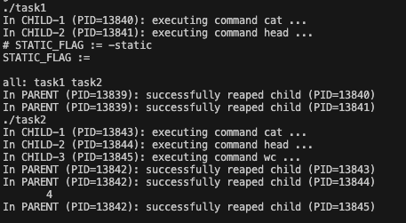

# Process Pipes and Command Execution

This experiment focuses on implementing command execution using process pipes in C. It demonstrates how Unix-like operating systems connect commands in a pipeline using the pipe mechanism.



## Project Structure

- **task1.c**: Implements a two-command pipeline
- **task2.c**: Implements a three-command pipeline
- **Makefile**: Provides compilation and execution targets
- **Lab-5-pipe-command-execution.pptx**: Slides explaining the lab concepts

## Compilation and Execution

To compile both programs:
```bash
make
```

To run both programs:
```bash
make run
```

To clean the compiled binaries:
```bash
make clean
```

## Task 1

Implements a pipe connecting two commands in a pipeline:
- Step 1: `cat Makefile | head -4` - Display the first 4 lines of the Makefile
- Step 2: `cat Makefile | wc -l` - Count the lines in the Makefile

Implementation details:
- The main process forks two child processes C1 and C2
- C1 executes the first command, C2 executes the second command
- A pipe bridges the output of C1 to the input of C2
- Uses `dup2()` to associate STDOUT_FILENO to the write end of the pipe in C1
- Uses `dup2()` to associate STDIN_FILENO to the read end of the pipe in C2
- Properly closes unused pipe file descriptors

## Task 2

Implements a pipeline with three commands:
- `cat Makefile | head -4 | wc -l` - Count the lines in the first 4 lines of the Makefile

Implementation details:
- Extends Task 1 with an additional process and pipe
- Creates two pipes to connect three processes
- Each command's output is piped to the next command's input

## Implementation Technologies

Both programs demonstrate:
- Creating pipes using the `pipe()` system call
- Forking child processes with `fork()`
- Redirecting standard input/output using `dup2()`
- Executing commands with `execvp()`
- Managing parent-child process relationships and waiting for child processes
